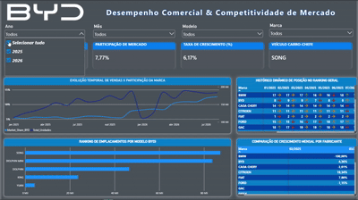

# Performance de Mercado e Dominância Temporal | BYD

Este projeto automatiza a extração, tratamento e consolidação de dados históricos de emplacamentos de automóveis a partir de relatórios mensais em formato PDF, gerando um dashboard executivo no Power BI focado na análise competitiva da marca BYD.

## 🛠️ Arquitetura da Solução

O pipeline de dados foi desenhado para resolver o problema de relatórios que misturam tabelas e gráficos em layouts complexos, seguindo o fluxo:
1. **Ingestão:** Leitura sequencial de 20 arquivos PDF (Janeiro/2025 a Agosto/2026).
2. **Processamento (Python):** Extração por padrão de texto corrido (Regex), fatiamento horizontal de tabelas lado a lado e limpeza de strings para tipos numéricos.
3. **Modelagem (Power BI):** Construção de modelo relacional com tabela calendário customizada e parâmetros de campo para alternância de eixos temporais.

---

## 🐍 1. Engenharia e Extração de Dados (Python)

A extração padrão por coordenadas de grade (`extract_table`) falhava devido à proximidade dos gráficos e tabelas paralelas na Página 6 do relatório. A solução foi ler o texto bruto da página e isolar a seção através de marcadores de início (`AUTOMÓVEIS`) e fim (`COMERCIAIS LEVES`), capturando o padrão via expressão regular.

O script gera uma coluna de data padronizada (`MM/AAAA`) lendo os metadados do nome do próprio arquivo.

```python
import os
import re
import pdfplumber
import pandas as pd

pasta_pdfs = r"../arquivosBrutos"
subpasta_destino = r"../arquivosProcessados_CSV"

if not os.path.exists(subpasta_destino):
    os.makedirs(subpasta_destino)

dados_consolidados = []

for nome_arquivo in os.listdir(pasta_pdfs):
    if nome_arquivo.lower().endswith(".pdf"):
        caminho_completo = os.path.join(pasta_pdfs, nome_arquivo)
        
        partes_nome = nome_arquivo.split("_")
        if len(partes_nome) >= 2:
            ano = partes_nome[0]
            mes_num = partes_nome[1]
            mes_ano_texto = f"{mes_num}/{ano}"
        else:
            mes_ano_texto = "01/2025"

        with pdfplumber.open(caminho_completo) as pdf:
            if len(pdf.pages) >= 6:
                pagina = pdf.pages[5]
                texto_pagina = pagina.extract_text()
                
                if texto_pagina:
                    linhas = texto_pagina.split("\n")
                    capturando_autos = False
                    
                    for linha in linhas:
                        if "AUTOMÓVEIS" in linha:
                            capturando_autos = True
                            continue
                        if "COMERCIAIS LEVES" in linha or "Fabricante" in linha:
                            capturando_autos = False
                        
                        if capturando_autos:
                            match = re.search(r"^(\d+)º\s+(.+?)\s+([\d.]+)\s+", linha.strip() + " ")
                            if match:
                                modelo = match.group(2).strip()
                                qtd_str = match.group(3).strip()
                                qtd_limpa = qtd_str.replace(".", "")
                                try:
                                    quantidade = int(qtd_limpa)
                                    if modelo.upper() not in ["MODELO", "TOTAL", "SUBTOTAL"]:
                                        dados_consolidados.append({
                                            "Modelo": modelo,
                                            "Quantidade": quantidade,
                                            "Data": mes_ano_texto
                                        })
                                except ValueError:
                                    continue

if dados_consolidados:
    df_final = pd.DataFrame(dados_consolidados)
    df_final = df_final[["Modelo", "Quantidade", "Data"]]
    caminho_salvamento = os.path.join(subpasta_destino, "dados_automoveis_consolidados.csv")
    df_final.to_csv(caminho_salvamento, index=False, sep=";", encoding="utf-8-sig")
```

---

## 📊 2. Modelagem de Dados e Regras de Negócio (DAX)

O modelo de dados utiliza uma estrutura Star Schema contendo a tabela de fatos unificada, uma tabela dimensão de tempo (`dCalendario`) ordenada por chaves numéricas (`AnoMesInt`), e uma tabela desconectada de controle por parâmetro para chaveamento dinâmico do eixo X.

### dCalendario
```dax
dCalendario = 
VAR DataMinima = MIN(FatoVendas[Data_Fato])
VAR DataMaxima = MAX(FatoVendas[Data_Fato])
RETURN
ADDCOLUMNS(
    CALENDAR(DataMinima, DataMaxima),
    "Ano", YEAR([Date]),
    "MesNum", MONTH([Date]),
    "MesAnoTexto", FORMAT([Date], "MM/YYYY"),
    "Trimestre", "T" & QUARTER([Date]) & "/" & YEAR([Date]),
    "Trimestre_Ordenacao", (YEAR([Date]) * 10) + QUARTER([Date])
)
```

### Medidas Principais desenvolvidas

*   **Volume Total de Vendas (Mercado):**
    ```dax
    Total_Unidades = SUM(FatoVendas[Quantidade])
    ```
*   **Volume de Vendas BYD:**
    ```dax
    Vendas_BYD = CALCULATE([Total_Unidades], FatoVendas[Marca] = "BYD")
    ```
*   **Market Share BYD:**
    ```dax
    Market_Share_BYD = DIVIDE([Vendas_BYD], CALCULATE([Total_Unidades], ALL(FatoVendas[Marca])))
    ```
*   **Ranking Dinâmico de Marcas:**
    ```dax
    Ranking_Marcas = RANKX(ALL(FatoVendas[Marca]), [Total_Unidades], , DESC)
    ```
*   **Evolução do Ranking com Trava de Histórico inicial (Janeiro/2025):**
    ```dax
    Evolucao_Ranking = 
    VAR DataAtual = MAX(dCalendario[Date])
    VAR AnoAtual = YEAR(DataAtual)
    VAR MesAtual = MONTH(DataAtual)
    VAR EhJaneiro2025 = (AnoAtual = 2025 && MesAtual = 1)
    
    VAR PosicaoAtual = [Ranking_Marcas]
    VAR PosicaoAnterior = CALCULATE([Ranking_Marcas], DATEADD(dCalendario[Date], -1, MONTH))
    RETURN
        IF(
            EhJaneiro2025,
            BLANK(),
            IF(ISBLANK(PosicaoAnterior) || ISBLANK(PosicaoAtual), BLANK(), PosicaoAnterior - PosicaoAtual)
        )
    ```

---

## 📈 3. Interface e Análise de Insights (Dashboard)

Abaixo está o comportamento do layout desenvolvido, aplicando tratamento de contornos, profundidade com sombras ocultas e KPIs no topo integrados em linha.



### Insights Técnicos Aplicados na Interface:
*   **Parâmetros de Campo (Field Parameters):** Tabela de ranking dinâmico configurada para se autoajustar trocando colunas físicas entre agrupamentos por **Trimestres Consolidados** ou **Período Total (Ano)** com um clique.
*   **Formatação Condicional Avançada:** Ícones de setas e cores na tabela principal vinculados exclusivamente à medida de bastidor (`Evolucao_Ranking`), enquanto os números exibem estritamente a posição real fixa do ranking.
*   **Análise 80/20 de Portfólio:** Gráfico de barras horizontais destaca a concentração de vendas da fabricante em produtos específicos de entrada.
